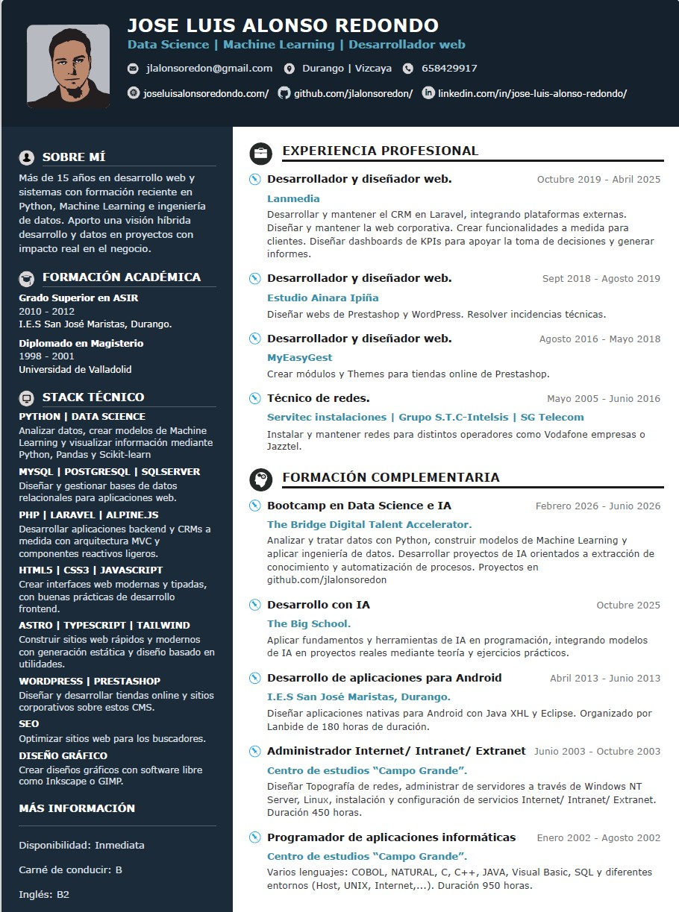

# Curriculum — Editor de CV



Un editor visual de currículums construido con Vite + React. Permite modificar el contenido en línea, personalizar secciones, ajustar el diseño y exportar el CV a PDF con un aspecto profesional y moderno.

## ✨ Características

- Edición en línea: haz clic en cualquier texto para modificarlo.
- Diseño modular: secciones como experiencia, formación y stack técnico.
- Exportación a PDF: imprime o guarda como PDF desde el navegador.
- Integración visual: incluye iconos, foto de perfil y un estilo tipo CV corporativo.
- Fácil de ejecutar: listo para trabajar con Vite y React.

## 🖼️ Vista previa

La imagen principal del proyecto se encuentra en [src/assets/img/cv.jpg](src/assets/img/cv.jpg). Sirve como referencia visual para mostrar el resultado final del editor.

## 🚀 Instalación y uso

```bash
npm install
npm run dev
```

Abre la URL que indique Vite, normalmente `http://localhost:5173/`, para ver el editor.

## 🧾 Exportar a PDF

Para generar el PDF:

1. Pulsa el botón de imprimir/guardar PDF.
2. En el navegador selecciona `Imprimir` o `Guardar como PDF`.
3. Ajusta márgenes y escala si es necesario.

## 🧩 Estructura del proyecto

- [src/App-f.jsx](src/App-f.jsx) — lógica principal del editor y renderizado del CV.
- [src/assets/img](src/assets/img) — recursos visuales, iconos e imagen principal.
- [public](public) — archivos estáticos.

## 🤝 Contribución

Si quieres mejorar el proyecto:

1. Haz fork del repositorio.
2. Crea una rama con tus cambios.
3. Abre un pull request describiendo lo que has modificado.

---

Este proyecto está pensado como una base rápida para crear currículums profesionales y personalizables con una experiencia de edición muy sencilla.
